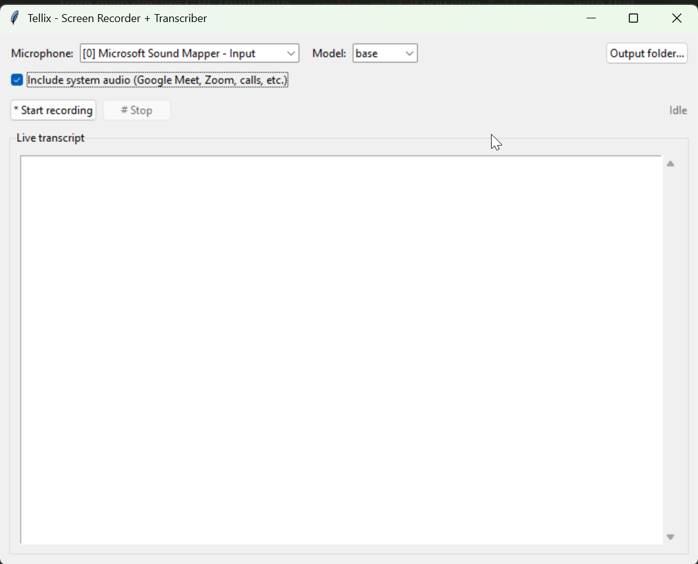

# Tellix

Lightweight Windows screen recorder with live + post-record transcription. Records the screen, captures the microphone (and optionally Google Meet / Zoom / system audio), streams live captions while recording, and produces a clean MP4 with embedded subtitles plus a timestamped transcript.

Everything runs locally. No API keys, no cloud upload, no telemetry.



> **Screenshot placeholder** — replace `docs/screenshot.png` with an actual capture of the running app (the recording dialog with the live transcript pane filled). Drop a 30-second demo as `docs/demo.gif` too if you can — Tellix can record itself for this.

## Download

Prebuilt `Tellix.exe` is published on the [Releases page](https://github.com/victorjoe/tellix/releases). Grab the latest version, copy it anywhere, double-click to launch. Windows SmartScreen will warn the first time — click **More info → Run anyway**.

If you'd rather run from source, see the Setup section below.

## Requirements

- Windows 10 or 11
- Python 3.10+ (for running from source; not needed for `Tellix.exe`)
- FFmpeg (place `ffmpeg.exe` in `tellix/bin/` or have it on `PATH`)
- ~500 MB of disk for the first Whisper model download (cached after that)
- NVIDIA GPU optional (5x speedup for transcription)

## Setup

```powershell
cd tellix
python -m venv .venv
.\.venv\Scripts\Activate.ps1
pip install -r requirements.txt
```

Download a static FFmpeg build for Windows (e.g., from gyan.dev) and drop `ffmpeg.exe` into `tellix/bin/`. Alternatively, install FFmpeg system-wide so it's on `PATH`.

## Run

```powershell
python app.py
```

Pick your microphone and Whisper model size from the top bar, optionally tick **Include system audio** if you're recording a meeting/call (Google Meet, Zoom, etc.), then click **Start recording**. Live captions stream into the transcript pane. Click **Stop** to finalize. Output lands in `output/tellix-<timestamp>/`:

- `recording.mp4` — final video with muxed audio
- `recording.srt` — timestamped subtitles
- `recording.txt` — plain transcript
- `screen.mp4`, `mic.wav` — raw intermediates (kept for debugging)
- `system.wav`, `mixed.wav` — only when system audio was enabled

## System audio (meetings / calls)

Tick **Include system audio** to capture both your microphone and whatever is playing through your speakers/headphones — that's how meeting participants in Google Meet, Zoom, Teams, etc. get into the recording. This uses Windows WASAPI loopback, so no virtual cable driver is required.

The two streams are mixed sample-by-sample in real time, so the live transcript and the final `recording.mp4` both contain both sides of the conversation.

The checkbox is disabled if WASAPI loopback isn't available on your system. If that happens, run `pip install -U sounddevice` to get a version with `WasapiSettings(loopback=True)` support.

## Model sizes

| Model    | Disk   | Speed (CPU) | Accuracy |
|----------|--------|-------------|----------|
| tiny     | ~75 MB | fastest     | low      |
| base     | ~150 MB| fast        | good     |
| small    | ~500 MB| moderate    | better   |
| medium   | ~1.5 GB| slow        | best     |

`base` is a good default. Bump to `small` for the final transcription pass if accuracy matters.

## Recover a transcript from an existing recording

If a session produced an empty / unhelpful `recording.txt`, you can re-run the
final-pass transcription on the saved WAV without re-recording:

```powershell
python retranscribe.py                                  # auto-picks most recent session
python retranscribe.py output\tellix-20260513-140745    # specific session
python retranscribe.py path\to\mic.wav --model medium   # any WAV + custom model
```

It overwrites `recording.srt` and `recording.txt` in the session folder.

## Build a standalone .exe

A PyInstaller spec is included so you can produce a single Windows
executable. Make sure `bin\ffmpeg.exe` is in place, then:

```powershell
.\.venv\Scripts\Activate.ps1
.\build.ps1
```

Output lands at `dist\Tellix.exe`, roughly 200–300 MB depending on which
native libraries get pulled in. The Whisper model is *not* bundled — it
downloads on first run into `%USERPROFILE%\.cache\huggingface\` so the
.exe stays small.

**Trade-offs of the one-file build:**

- First launch takes 5–10 seconds while PyInstaller's bootloader
  extracts the bundle to a temp dir. Subsequent launches are fast.
- Some antivirus heuristics flag PyInstaller `--onefile` bundles. Sign
  the binary if you plan to distribute.
- Recordings are saved next to the `.exe` (under `output\`), not into
  the temp extraction dir, so they persist across runs.

## Troubleshooting

- **"FFmpeg not found"** — drop `ffmpeg.exe` into `tellix/bin/` or add to PATH.
- **"Microphone failed"** — Windows 11 may need explicit consent: Settings → Privacy & security → Microphone → allow desktop apps.
- **"WASAPI loopback unavailable"** — run `pip install soundcard` in your venv. sounddevice itself doesn't support WASAPI loopback in any released version; we use the `soundcard` library for that piece.
- **Live captions are noisy** — that's by design; the final pass after Stop uses a larger model and is the authoritative transcript.
- **Empty `recording.txt`** — run `python retranscribe.py` against the session folder. If it still comes out empty, open `mic.wav` directly in a media player to verify the audio is actually present at a normal volume.
- **First start is slow** — Whisper downloads the model from HuggingFace on first run. Cached afterward.

## License

Tellix is released under the [MIT License](LICENSE). You can use it, modify it, and distribute it freely.

### Third-party components

Tellix depends on several open-source libraries; see [NOTICE.md](NOTICE.md) for the full attribution list and links to each project's license.

### A note about FFmpeg

Tellix does **not** bundle FFmpeg in this repository. The published `Tellix.exe` on the Releases page does bundle a static FFmpeg build, but you should know the legal context if you fork Tellix or build your own .exe:

- Most popular static FFmpeg builds for Windows (e.g. from gyan.dev) are compiled with `--enable-gpl`. Distributing a binary that includes a GPL FFmpeg means the whole bundle inherits GPL terms — you must offer the FFmpeg source on request and your fork's distributed binaries must be GPL-compatible.
- If you want to stay under the more permissive MIT license end-to-end, use an **LGPL** build of FFmpeg (compiled without `--enable-gpl`). Several are available; search "FFmpeg LGPL Windows build" to find current options.
- If you run from source and let users supply their own FFmpeg, none of this applies to your distribution — the user is responsible for their FFmpeg copy.

Full details: https://ffmpeg.org/legal.html

## Contributing

Issues and pull requests welcome. If you're filing a bug, include your Windows version, Python version, and the contents of the FFmpeg log if applicable (`screen.ffmpeg.log` inside the session folder).
